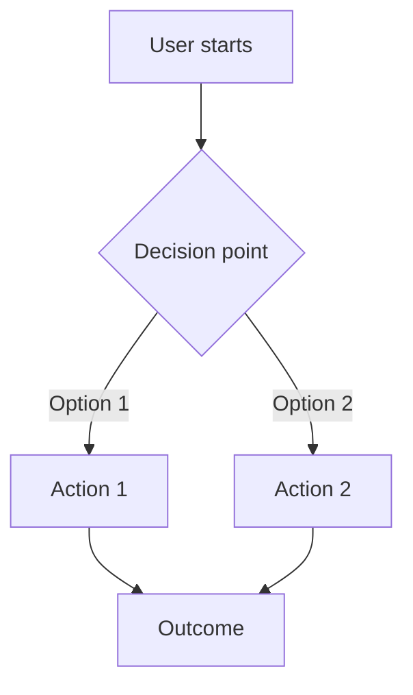

# Product Requirements Document: [Project Name]

**Version**: 1.0
**Date**: [Date]
**Author**: [Author]
**Status**: Draft | Review | Approved

---

## Project Overview

### Problem Statement

[What problem are we solving for users? Why does this matter?]

### Goals

[What do we want users to be able to accomplish? List 3-5 clear goals.]

1. Users can [goal 1]
2. Users can [goal 2]
3. Users can [goal 3]

### Scope

**In Scope:**
- [Feature/capability 1]
- [Feature/capability 2]

**Out of Scope:**
- [Explicitly excluded item 1]
- [Explicitly excluded item 2]

### Success Metrics

| Metric | Target | How Measured |
|--------|--------|--------------|
| [User adoption] | [X%] | [Analytics] |
| [Task completion rate] | [X%] | [User testing] |
| [User satisfaction] | [X/5] | [Survey] |

---

## User Flows

### Primary User Journey

### User Journey Map

| Stage | User Action | User Feeling | System Response |
|-------|-------------|--------------|-----------------|
| Discovery | [How user finds feature] | [Expected emotion] | [What system shows] |
| Onboarding | [First interaction] | [Expected emotion] | [Guidance provided] |
| Core Task | [Main action] | [Expected emotion] | [System feedback] |
| Completion | [Finishing action] | [Expected emotion] | [Confirmation] |

### Alternative Flows

[Describe secondary paths users might take]

---

## Functional Requirements

### User Stories

| ID | User Story | Priority | Acceptance Criteria |
|----|------------|----------|---------------------|
| US-001 | As a [user type], I want to [action] so that [benefit] | High | Given [context], When [action], Then [outcome] |
| US-002 | As a [user type], I want to [action] so that [benefit] | Medium | Given [context], When [action], Then [outcome] |
| US-003 | As a [user type], I want to [action] so that [benefit] | Low | Given [context], When [action], Then [outcome] |

### User Capabilities

Users can:

1. **[Capability Name]**: [Description of what users can do]
   - [Sub-capability 1]
   - [Sub-capability 2]

2. **[Capability Name]**: [Description of what users can do]
   - [Sub-capability 1]
   - [Sub-capability 2]

---

## Non-Functional Requirements

### Performance Expectations

From the user's perspective:
- Pages load within [X] seconds
- Actions complete within [X] seconds
- No visible lag during [specific interactions]

### Accessibility

- Screen reader compatible for all content
- Keyboard navigation for all actions
- Color contrast ratio of at least [4.5:1]
- Text resizable up to [200%] without loss of functionality
- [WCAG 2.1 AA/AAA] compliance

### Usability

- Maximum [X] clicks to complete core tasks
- Clear, plain-language error messages
- Consistent navigation across all pages
- Mobile-responsive design
- [Specific usability requirements]

### Availability

- Feature available [X]% of the time
- Graceful degradation when [specific service] unavailable
- Clear messaging when feature unavailable

---

## Known Limitations

1. **[Limitation 1]**: [Why this is out of scope for this version]
2. **[Limitation 2]**: [Why this is out of scope for this version]
3. **[Limitation 3]**: [Technical or resource constraint]

---

## Future Scope

Potential enhancements for future versions:

1. **[Future Feature 1]**: [Brief description and value]
2. **[Future Feature 2]**: [Brief description and value]
3. **[Future Feature 3]**: [Brief description and value]

---

## Appendix

### Glossary

| Term | Definition |
|------|------------|
| [Term 1] | [Plain language definition] |
| [Term 2] | [Plain language definition] |

### References

- [Link to user research]
- [Link to competitive analysis]
- [Link to related documentation]

---

## Revision History

| Version | Date | Author | Changes |
|---------|------|--------|---------|
| 1.0 | [Date] | [Author] | Initial draft |
