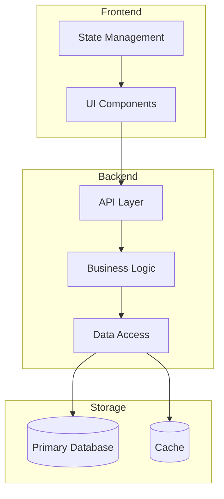
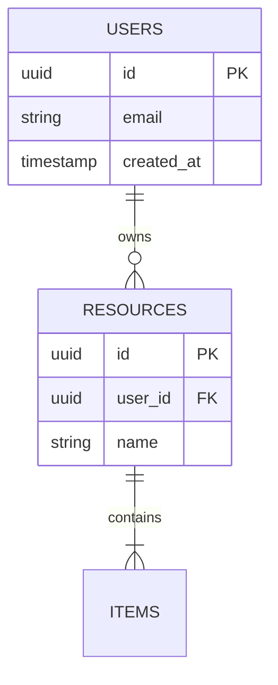

# Technical Design Document: [Project Name]

**Version**: 1.0
**Date**: [Date]
**Author**: [Author]
**Status**: Draft | Review | Approved
**PRD Reference**: [Link to PRD]

---

## Architecture

### System Design



### Components

| Component | Responsibility | Technology | Owner |
|-----------|---------------|------------|-------|
| [Component 1] | [What it does] | [Stack] | [Team] |
| [Component 2] | [What it does] | [Stack] | [Team] |

### Data Flow

1. User initiates [action] in UI
2. Frontend sends request to [endpoint]
3. Backend validates request
4. Business logic processes [what]
5. Data persisted to [storage]
6. Response returned to user

---

## API Specifications

### Endpoints

#### [METHOD] /api/[resource]

**Purpose**: [What this endpoint does]

**Authentication**: Required | Optional | None
**Authorization**: [Required roles/permissions]

**Request**:
```json
{
  "field1": "string - description",
  "field2": "number - description",
  "field3": {
    "nested": "object - description"
  }
}
```

**Response (200 OK)**:
```json
{
  "id": "string - resource identifier",
  "field1": "string - description",
  "createdAt": "ISO8601 timestamp"
}
```

**Error Responses**:

| Status | Code | Description | Response Body |
|--------|------|-------------|---------------|
| 400 | INVALID_INPUT | [When this occurs] | `{"error": "code", "message": "details"}` |
| 401 | UNAUTHORIZED | [When this occurs] | `{"error": "code", "message": "details"}` |
| 403 | FORBIDDEN | [When this occurs] | `{"error": "code", "message": "details"}` |
| 404 | NOT_FOUND | [When this occurs] | `{"error": "code", "message": "details"}` |
| 429 | RATE_LIMITED | [When this occurs] | `{"error": "code", "retryAfter": seconds}` |
| 500 | INTERNAL_ERROR | [When this occurs] | `{"error": "code", "message": "details"}` |

---

## Database Schema

### Tables/Collections

#### [table_name]

| Column | Type | Constraints | Description |
|--------|------|-------------|-------------|
| id | UUID | PK, NOT NULL | Primary identifier |
| [field] | [TYPE] | [CONSTRAINTS] | [Description] |
| created_at | TIMESTAMP | NOT NULL, DEFAULT NOW() | Creation timestamp |
| updated_at | TIMESTAMP | NOT NULL | Last update timestamp |

### Relationships



### Indexes

| Table | Index Name | Columns | Type | Purpose |
|-------|------------|---------|------|---------|
| users | idx_users_email | email | UNIQUE | Email lookup |
| resources | idx_resources_user | user_id | BTREE | User's resources query |

### Constraints

- Foreign key: `resources.user_id` -> `users.id` (ON DELETE CASCADE)
- Check: `resources.quantity >= 0`
- Unique: `users.email`

---

## Dependencies

### External Dependencies

| Dependency | Version | Purpose | License | Risk |
|------------|---------|---------|---------|------|
| [library] | ^X.Y.Z | [Why needed] | [License] | [Risk level] |

### Internal Dependencies

| Module | Exposure | Impact | Fallback |
|--------|----------|--------|----------|
| [service] | Internal API | [Required/Optional] | [What happens if unavailable] |

### Third-Party Integrations

| Service | Purpose | Rate Limits | Fallback Strategy |
|---------|---------|-------------|-------------------|
| [Service] | [Why used] | [Limits] | [What happens if unavailable] |

---

## Security Implementation

### Abuse Prevention (Bad Actors)

| Threat | Mitigation | Implementation |
|--------|------------|----------------|
| Unauthorized access | Authentication required | JWT with [expiry], refresh tokens |
| Brute force attacks | Account lockout | Lock after [N] failed attempts for [duration] |
| Spam/abuse | Rate limiting | [X] requests per [window] |
| DDoS | Infrastructure protection | CDN, WAF, auto-scaling |
| Bot attacks | Bot detection | CAPTCHA on [sensitive actions] |
| Credential stuffing | Breach detection | Monitor for known breached credentials |

### Protection for Unaware Users (Input Validation)

| Risk | Protection | Implementation |
|------|------------|----------------|
| XSS | Output encoding | Escape all user content, CSP headers |
| SQL Injection | Parameterized queries | ORM with prepared statements |
| CSRF | Token validation | CSRF tokens on state-changing requests |
| Path traversal | Input sanitization | Validate and sanitize file paths |
| Clickjacking | Frame protection | X-Frame-Options: DENY |

### Resource Management (Rate Limiting)

| Resource | Limit | Window | Response | Headers |
|----------|-------|--------|----------|---------|
| API requests | [X] | [1 minute] | 429 | X-RateLimit-* |
| File uploads | [X] | [1 hour] | 429 | Retry-After |
| Auth attempts | [X] | [15 min] | Account lock | - |
| Search queries | [X] | [1 minute] | 429 | X-RateLimit-* |

### Authorization Controls

| Role | Description | Permissions |
|------|-------------|-------------|
| Guest | Unauthenticated user | Read public content only |
| User | Authenticated user | CRUD own resources |
| Admin | Administrator | Full access, audit logged |

**Authorization Matrix**:

| Endpoint | Guest | User | Admin |
|----------|-------|------|-------|
| GET /api/public | Yes | Yes | Yes |
| GET /api/resources | No | Own | All |
| POST /api/resources | No | Yes | Yes |
| PUT /api/resources/:id | No | Own | All |
| DELETE /api/resources/:id | No | Own | All |

---

## Performance

### Scalability

| Component | Strategy | Implementation |
|-----------|----------|----------------|
| API servers | Horizontal scaling | Stateless, load balanced |
| Database | Read replicas | Primary-replica setup |
| Cache | Distributed | Redis cluster |
| Files | CDN | [CDN provider] |

### Caching Strategy

| Data | Location | TTL | Invalidation |
|------|----------|-----|--------------|
| User sessions | Redis | 24h | On logout |
| API responses | CDN | 5min | On data change |
| Database queries | Application | 1min | On write |
| Static assets | CDN | 1 year | Version hash |

### Optimization Approaches

- [ ] Lazy loading for non-critical resources
- [ ] Database query optimization with EXPLAIN
- [ ] Connection pooling (pool size: [X])
- [ ] Gzip/Brotli compression for responses
- [ ] Image optimization and responsive images
- [ ] Code splitting and tree shaking

### Performance Targets

| Metric | Target | Measurement |
|--------|--------|-------------|
| API response time (p50) | < [X]ms | [Tool] |
| API response time (p99) | < [X]ms | [Tool] |
| Page load time | < [X]s | [Tool] |
| Time to interactive | < [X]s | [Tool] |

---

## Implementation Details

### Algorithms

#### [Algorithm Name]

**Purpose**: [What problem it solves]
**Complexity**: O([time]) time, O([space]) space
**Implementation**:
```
[Pseudocode or key logic]
```
**Trade-offs**: [Why this approach vs alternatives]

### Data Structures

| Structure | Usage | Justification |
|-----------|-------|---------------|
| [Structure] | [Where used] | [Why chosen] |

### Design Patterns

| Pattern | Usage | Justification |
|---------|-------|---------------|
| Repository | Data access | Abstracts storage, enables testing |
| Factory | Object creation | Handles multiple resource types |
| Observer | Events | Decouples components |

### Code Organization

```
src/
├── api/           # Route handlers and middleware
│   ├── routes/
│   └── middleware/
├── services/      # Business logic
├── repositories/  # Data access layer
├── models/        # Data structures and validation
├── utils/         # Shared utilities
└── config/        # Configuration management
```

---

## Migration Plan

### Database Migrations

| Migration | Description | Reversible | Risk |
|-----------|-------------|------------|------|
| [001_create_tables] | [Description] | Yes | Low |

### Rollback Strategy

1. [Step to rollback]
2. [Step to verify]
3. [Step to communicate]

---

## Monitoring and Observability

### Metrics

| Metric | Type | Alert Threshold |
|--------|------|-----------------|
| Request rate | Counter | > [X] req/s |
| Error rate | Gauge | > [X]% |
| Response time | Histogram | p99 > [X]ms |

### Logging

| Event | Level | Fields |
|-------|-------|--------|
| Request | INFO | request_id, user_id, path |
| Error | ERROR | request_id, error, stack |

---

## Revision History

| Version | Date | Author | Changes |
|---------|------|--------|---------|
| 1.0 | [Date] | [Author] | Initial draft |
