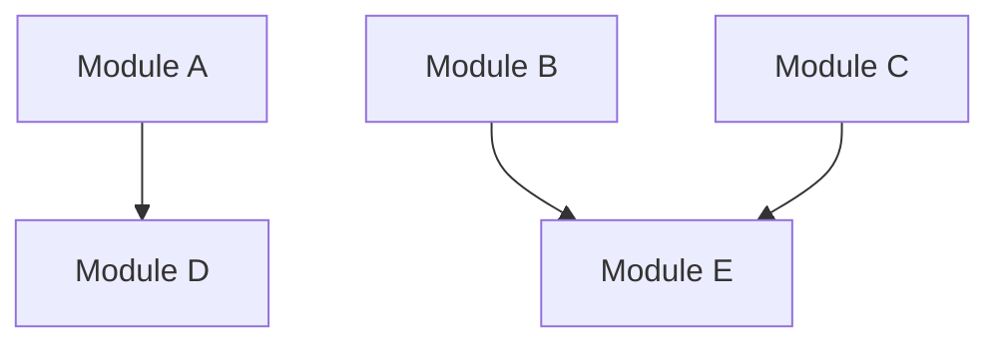

# Ralph: Autonomous Implementation Loop with Parallel Subagents

Execute an autonomous implementation loop that spawns isolated subagents for parallel implementation work.

## Pre-Flight Check

Before starting, validate prerequisites:

### 1. Check for Existing Tests

Look for test files matching the feature name:
- `tests/unit/[feature].test.ts`
- `tests/integration/[feature].test.ts`
- `tests/e2e/[feature].spec.ts`

If no tests found:
```
⛔ CANNOT START RALPH

No tests found for: [feature]

Required: Run /test:write [feature] first

TDD Workflow:
1. /spec:write [feature] → Generate PRD + TDD
2. /test:functional [feature] → Generate test cases
3. /test:write [feature] → Write failing tests
4. /ralph [feature] → Implementation loop (you are here)
```

### 2. Verify Tests Fail (Red Phase)

Run tests to confirm they fail:
```bash
bun test tests/unit/[feature].test.ts
```

If tests pass unexpectedly:
```
⚠️ WARNING: Tests pass without implementation

This suggests either:
1. Implementation already exists
2. Tests are mocked incorrectly
3. Tests are not testing the right thing

Please verify tests before proceeding.
```

## Module Analysis Phase

Before implementation, analyze the feature to identify parallelizable modules:

### 1. Analyze Test Structure

```bash
# List all test files for the feature
find tests -name "*[feature]*" -type f

# Extract test describe blocks to identify modules
grep -h "describe\|test\|it(" tests/unit/[feature].test.ts
```

### 2. Identify Independent Modules

Parse tests to find modules that can be implemented in parallel:

```markdown
## Module Dependency Analysis

### Independent Modules (can run in parallel)
- Module A: [tests that don't depend on other modules]
- Module B: [tests that don't depend on other modules]
- Module C: [tests that don't depend on other modules]

### Dependent Modules (must run sequentially)
- Module D: depends on Module A
- Module E: depends on Module B, Module C

### Dependency Graph

```

### 3. Create Execution Plan

```markdown
## Execution Plan

### Phase 1: Parallel Implementation
Spawn subagents for independent modules:
- Task(impl-agent): Module A
- Task(impl-agent): Module B
- Task(impl-agent): Module C

### Phase 2: Sequential Implementation
After Phase 1 completes:
- Task(impl-agent): Module D (needs A)
- Task(impl-agent): Module E (needs B, C)

### Phase 3: Integration
- Run full test suite
- Validate coverage
```

## Implementation with Subagents

### Spawning Parallel Subagents

For each independent module, spawn an isolated implementation subagent using the Task tool:

```
[Single message with multiple Task tool calls]

Task 1:
  subagent_type: "general-purpose"
  description: "Implement [Module A]"
  prompt: |
    ## Task: Implement [Module A] for [Feature]

    ### Context
    You are implementing ONE module of a larger feature.
    Your context is isolated - focus only on this module.

    ### Tests to Pass
    File: tests/unit/[feature].test.ts
    Specific tests:
    - [test name 1]
    - [test name 2]

    ### Test Content
    [Include actual test code for this module]

    ### TDD Specifications
    [Relevant section from TDD doc]

    ### Output Location
    - src/[feature]/[module-a].ts

    ### Process
    1. Read the tests carefully
    2. Write minimal code to pass each test
    3. Run: bun test tests/unit/[feature].test.ts -t "[module pattern]"
    4. Iterate until all module tests pass

    ### Return
    Report back:
    - Files created/modified
    - Tests passing: X/Y
    - Any issues encountered

Task 2:
  subagent_type: "general-purpose"
  description: "Implement [Module B]"
  prompt: [similar structure...]

Task 3:
  subagent_type: "general-purpose"
  description: "Implement [Module C]"
  prompt: [similar structure...]
```

### Subagent Prompt Template

Each subagent receives:

```markdown
## Task: Implement [Module Name] for [Feature]

### Context
- Feature: [feature name]
- Module: [module name]
- Isolation: Your context is isolated. Focus only on this module.

### Tests to Pass
File: [test file path]
Test pattern: [describe block or test name pattern]

```typescript
// Actual test code for this module
describe('[Module]', () => {
  test('should [behavior]', () => {
    // test implementation
  });
});
```

### Specifications (from TDD)
[Relevant TDD section for this module]

### Dependencies
- External packages: [list]
- Internal modules: [list, if any]
- Types needed: [type definitions]

### Output Files
- Primary: src/[feature]/[module].ts
- Types: src/[feature]/types/[module].ts (if needed)

### Implementation Rules
1. Write minimal code to pass tests
2. Follow existing codebase patterns
3. No `any` types
4. Handle errors explicitly
5. Export only what's needed

### Process
1. Understand what each test expects
2. Write code to pass ONE test at a time
3. Run: `bun test [test-file] -t "[module-pattern]"`
4. Iterate until all module tests pass

### Success Criteria
- All tests matching "[module-pattern]" pass
- TypeScript compiles without errors
- No lint errors in new code

### Return Format
```json
{
  "module": "[module name]",
  "status": "complete|partial|failed",
  "files_created": ["path1", "path2"],
  "files_modified": ["path3"],
  "tests_passing": "X/Y",
  "tests_failing": ["test name if any"],
  "issues": ["any blockers or concerns"]
}
```
```

## Result Aggregation

After all subagents complete, aggregate results:

### 1. Collect Subagent Results

```markdown
## Subagent Results

### Module A (Subagent 1)
- Status: Complete
- Files: src/[feature]/module-a.ts
- Tests: 5/5 passing

### Module B (Subagent 2)
- Status: Complete
- Files: src/[feature]/module-b.ts
- Tests: 3/3 passing

### Module C (Subagent 3)
- Status: Partial (2/4 tests passing)
- Issues: [specific issue]
```

### 2. Handle Partial Results

If any subagent reports partial completion:
1. Analyze the failing tests
2. Spawn a focused fix subagent with additional context
3. Retry up to 2 times

### 3. Run Integration Tests

After all modules complete:

```bash
# Full unit test suite
bun test tests/unit/[feature].test.ts

# Integration tests
bun test tests/integration/[feature].test.ts

# E2E tests
bun run playwright test tests/e2e/[feature].spec.ts
```

## Completion Validation

### Full Validation Suite

```bash
# TypeScript
bunx tsc --noEmit

# Lint
bun run lint

# Tests with coverage
bun test --coverage

# E2E
bun run playwright test tests/e2e/[feature].spec.ts
```

### Completion Report

```markdown
## Ralph Loop Complete ✅

### Summary
- **Feature**: [feature name]
- **Mode**: Parallel Subagents
- **Subagents Spawned**: N
- **Total Iterations**: M (across all subagents)

### Module Results
| Module | Subagent | Tests | Status |
|--------|----------|-------|--------|
| A | 1 | 5/5 | ✅ |
| B | 2 | 3/3 | ✅ |
| C | 3 | 4/4 | ✅ |

### Test Results
- Unit: X/X passing (100%)
- Integration: Y/Y passing (100%)
- E2E: Z/Z passing (100%)
- Coverage: N%

### Files Created/Modified
- `src/[feature]/module-a.ts`
- `src/[feature]/module-b.ts`
- `src/[feature]/module-c.ts`
- `src/[feature]/types.ts`

### Quality Checks
- [x] TypeScript: No errors
- [x] Lint: No errors
- [x] Coverage: >= 80%

### Next Steps
1. Run: /self-check
2. If passes: /commit -m "feat: implement [feature]"
```

## Error Handling

### Subagent Failure

If a subagent fails completely:
1. Log the failure with details
2. Check if tests are valid
3. Spawn retry subagent with enhanced context
4. After 2 retries, escalate to user

### Subagent Timeout

If a subagent takes too long:
1. Check progress via partial results
2. Consider breaking module into smaller pieces
3. Spawn focused subagents for remaining tests

### Context Overflow in Subagent

If subagent reports context issues:
1. Break module into smaller sub-modules
2. Spawn multiple focused subagents
3. Aggregate partial results

## Arguments

| Argument | Description | Default |
|----------|-------------|---------|
| `FEATURE_NAME` | Name of the feature to implement | Required |
| `--max-iterations N` | Stop after N total iterations | 50 |
| `--parallel` | Force parallel mode even for small features | false |
| `--modules M1,M2,M3` | Manually specify modules to parallelize | auto-detect |
| `--sequential` | Disable parallel mode, run single-agent loop | false |

## Examples

```bash
# Implement with auto-detected parallel modules
/ralph user-authentication

# Force parallel mode with specific modules
/ralph checkout-flow --parallel --modules cart,payment,confirmation

# Implement with iteration limit
/ralph api-rate-limiting --max-iterations 30

# Force sequential mode (original behavior)
/ralph simple-feature --sequential
```

## Mode Selection

Ralph automatically selects the best mode:

| Condition | Mode | Reason |
|-----------|------|--------|
| < 5 tests | Sequential | Overhead not worth it |
| Independent modules detected | Parallel | Faster completion |
| All tests interdependent | Sequential | Can't parallelize |
| `--parallel` flag | Parallel | User override |
| `--sequential` flag | Sequential | User override |
