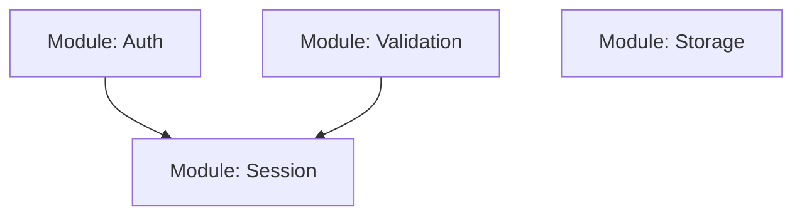

# Ralph: Autonomous Implementation Loop with Parallel Subagents

This skill enables autonomous implementation using **isolated subagents** for parallel work. Each subagent runs in its own context, preventing context pollution and enabling faster completion.

## Architecture

```
┌─────────────────────────────────────────────────────────────────────────────┐
│                         RALPH ORCHESTRATOR                                   │
├─────────────────────────────────────────────────────────────────────────────┤
│                                                                             │
│  Phase 1: Analysis                                                          │
│  ├── Parse test structure                                                   │
│  ├── Identify independent modules                                           │
│  └── Create dependency graph                                                │
│                                                                             │
│  Phase 2: Parallel Implementation                                           │
│  ┌──────────────┐   ┌──────────────┐   ┌──────────────┐                    │
│  │  Sub-Agent   │   │  Sub-Agent   │   │  Sub-Agent   │                    │
│  │  Module A    │   │  Module B    │   │  Module C    │                    │
│  │  [isolated]  │   │  [isolated]  │   │  [isolated]  │                    │
│  └──────┬───────┘   └──────┬───────┘   └──────┬───────┘                    │
│         │                  │                  │                             │
│         └────────┬─────────┴─────────┬───────┘                             │
│                  ▼                   ▼                                      │
│  Phase 3: Result Aggregation                                               │
│  ├── Collect outputs from all subagents                                    │
│  ├── Handle partial completions                                            │
│  └── Spawn fix subagents if needed                                         │
│                                                                             │
│  Phase 4: Integration & Validation                                         │
│  ├── Run full test suite                                                   │
│  ├── Check coverage                                                        │
│  └── Generate completion report                                            │
│                                                                             │
└─────────────────────────────────────────────────────────────────────────────┘
```

## Prerequisites

Before running Ralph, ensure:
1. **Specs exist**: PRD + TDD in `docs/specs/`
2. **Functional test cases exist**: In `docs/test-cases/`
3. **Tests exist and FAIL**: Unit/integration/E2E tests in `tests/`

If any prerequisite is missing, use these commands first:
- `/spec:write [feature]` - Generate specifications
- `/test:functional [feature]` - Generate functional test cases
- `/test:write [feature]` - Write tests (they should FAIL)

## Workflow

### Phase 1: Pre-Flight & Analysis

#### 1.1 Validate Prerequisites

```bash
# Check for failing tests
bun test tests/unit/[feature].test.ts
# Expected: Tests should FAIL (no implementation yet)
```

If tests don't exist → BLOCK with guidance to run `/test:write` first
If tests pass unexpectedly → BLOCK with warning

#### 1.2 Analyze Module Structure

```bash
# Extract test describe blocks to identify modules
grep -h "describe(" tests/unit/[feature].test.ts
```

Parse the output to identify:
- **Independent modules**: Can be implemented in parallel
- **Dependent modules**: Must wait for dependencies

#### 1.3 Create Execution Plan

```markdown
## Execution Plan for [Feature]

### Dependency Analysis


### Phase 1: Parallel (Independent)
- Task(impl-agent): Auth module
- Task(impl-agent): Validation module
- Task(impl-agent): Storage module

### Phase 2: Sequential (Dependent)
- Task(impl-agent): Session module (after Auth, Validation)
```

### Phase 2: Spawn Implementation Subagents

#### Key Principle: Isolated Contexts

Each subagent gets:
- Fresh context (no bleeding from other work)
- Only the tests relevant to their module
- Focused TDD specifications
- Clear success criteria

#### Spawning Pattern

Use **multiple Task tool calls in a single message** for parallel execution:

```
[Single response with multiple Task tool calls]

Task 1:
  subagent_type: "general-purpose"
  description: "Implement auth module"
  prompt: [detailed prompt with tests, specs, rules]

Task 2:
  subagent_type: "general-purpose"
  description: "Implement validation module"
  prompt: [detailed prompt with tests, specs, rules]

Task 3:
  subagent_type: "general-purpose"
  description: "Implement storage module"
  prompt: [detailed prompt with tests, specs, rules]
```

#### Subagent Prompt Structure

Each subagent prompt MUST include:

```markdown
## Task: Implement [Module Name] for [Feature]

### Context
- Feature: [feature name]
- Module: [module name]
- Isolation: Your context is isolated. Focus ONLY on this module.

### Tests to Pass
File: [test file path]
Test pattern: [describe block name]

```typescript
// ACTUAL test code for this module (copy from test file)
describe('[Module]', () => {
  test('should do X', () => { ... });
  test('should handle Y', () => { ... });
});
```

### Specifications (from TDD)
[Copy relevant section from TDD document]

### Dependencies
- External: [npm packages needed]
- Internal: [other modules to import, with their interfaces]
- Types: [type definitions needed]

### Output Files
- Primary: src/[feature]/[module].ts
- Types: src/[feature]/types/[module].ts (if needed)

### Rules
1. Write minimal code to pass tests
2. Follow existing codebase patterns
3. No `any` types
4. Handle errors explicitly

### Process
1. Read tests to understand expectations
2. Write code for ONE test at a time
3. Run: `bun test [file] -t "[pattern]"`
4. Iterate until all module tests pass

### Return Format
Return a JSON report:
```json
{
  "module": "[name]",
  "status": "complete|partial|failed",
  "files_created": ["path1"],
  "files_modified": ["path2"],
  "tests_passing": "X/Y",
  "tests_failing": ["test name"],
  "issues": ["blockers"]
}
```
```

### Phase 3: Result Aggregation

After all subagents complete:

#### 3.1 Collect Results

```markdown
## Subagent Results

| Module | Status | Tests | Files |
|--------|--------|-------|-------|
| Auth | Complete | 5/5 | auth.ts |
| Validation | Complete | 3/3 | validation.ts |
| Storage | Partial | 2/4 | storage.ts |
```

#### 3.2 Handle Partial Completions

If any subagent returns `status: "partial"`:

1. **Analyze**: What tests are still failing?
2. **Enhance**: Add more context from error messages
3. **Retry**: Spawn focused fix subagent

```
Task (retry):
  subagent_type: "general-purpose"
  description: "Fix storage module tests"
  prompt: |
    ## Previous attempt failed on these tests:
    - test: "should handle large files"
    - error: [error message]

    ## Additional context:
    [Include what the previous subagent tried]

    ## Your task:
    Fix the remaining 2 failing tests...
```

#### 3.3 Sequential Phase (if needed)

For dependent modules, spawn after dependencies complete:

```
# After Auth and Validation complete:
Task:
  subagent_type: "general-purpose"
  description: "Implement session module"
  prompt: |
    ## Dependencies (already implemented)
    - Auth module: src/[feature]/auth.ts
    - Validation module: src/[feature]/validation.ts

    ## Your task:
    Implement Session module using the above...
```

### Phase 4: Integration & Validation

#### 4.1 Run Full Test Suite

```bash
# All unit tests
bun test tests/unit/[feature].test.ts

# Integration tests
bun test tests/integration/[feature].test.ts

# E2E tests
bun run playwright test tests/e2e/[feature].spec.ts
```

#### 4.2 Validation Checks

```bash
# TypeScript compilation
bunx tsc --noEmit

# Linting
bun run lint

# Coverage
bun test --coverage
# Required: >= 80%
```

#### 4.3 Completion Report

```markdown
## Ralph Loop Complete ✅

### Summary
- **Feature**: [name]
- **Mode**: Parallel Subagents
- **Subagents Spawned**: N
- **Retries**: M

### Module Results
| Module | Subagent | Attempts | Tests | Status |
|--------|----------|----------|-------|--------|
| Auth | 1 | 1 | 5/5 | ✅ |
| Validation | 2 | 1 | 3/3 | ✅ |
| Storage | 3 | 2 | 4/4 | ✅ |
| Session | 4 | 1 | 6/6 | ✅ |

### Final Validation
- Unit: 18/18 passing (100%)
- Integration: 8/8 passing (100%)
- E2E: 5/5 passing (100%)
- Coverage: 87%

### Files Created
- src/[feature]/auth.ts
- src/[feature]/validation.ts
- src/[feature]/storage.ts
- src/[feature]/session.ts
- src/[feature]/types.ts

### Next Steps
1. /self-check
2. /commit -m "feat: implement [feature]"
```

## Mode Selection

Ralph automatically selects the best execution mode:

| Condition | Mode | Why |
|-----------|------|-----|
| < 5 tests total | Sequential | Subagent overhead not worth it |
| ≥ 3 independent modules | Parallel | Significant speedup |
| All tests interdependent | Sequential | Can't parallelize |
| `--parallel` flag | Parallel | User override |
| `--sequential` flag | Sequential | User override |

## Error Handling

### Subagent Failure (All Retries Exhausted)

```markdown
## Ralph: Subagent Failed

### Module: [name]
### Attempts: 3
### Final Status: Failed

### Failing Tests
- test: "[name]"
- error: [message]

### Files Created (partial)
- src/[feature]/[module].ts (incomplete)

### Request for User
Need guidance on:
1. [Specific question about failing test]
2. [Specific question about implementation]
```

### Context Overflow

If a subagent reports context overflow:
1. Break the module into smaller sub-modules
2. Spawn multiple focused subagents
3. Each handles a subset of tests

## Integration with Orchestration

Ralph integrates with the orchestration workflow:

```
Orchestrator
├── Task(spec-writer) → PRD + TDD
├── Task(functional-test-writer) → Test cases
├── Task(test-writer) → Failing tests
├── /ralph [feature] ← YOU ARE HERE
│   ├── Analysis phase
│   ├── Task(impl-agent) × N (parallel)
│   ├── Task(impl-agent) × M (sequential)
│   └── Validation phase
├── /self-check → Final validation
└── /commit → Commit
```

## Usage

```bash
# Auto-detect modules, use parallel if beneficial
/ralph user-authentication

# Force parallel with specific modules
/ralph checkout --parallel --modules cart,payment,shipping

# Limit total iterations across all subagents
/ralph api-gateway --max-iterations 100

# Force sequential (original single-agent behavior)
/ralph simple-fix --sequential
```

## Benefits of Parallel Subagents

| Benefit | Description |
|---------|-------------|
| **Isolated Contexts** | No bleeding between modules |
| **Faster Completion** | Multiple modules implemented simultaneously |
| **Better Focus** | Each subagent only sees relevant tests |
| **Easier Debugging** | Failures isolated to specific modules |
| **Retry Efficiency** | Only retry failed modules, not entire feature |
